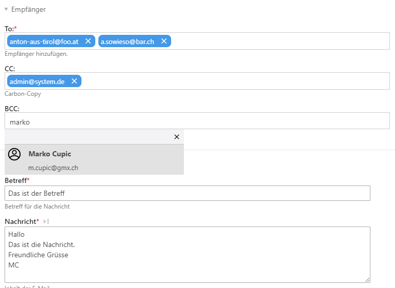

# Contao Backend E-Mail
Contao E-Mail Erweiterung für den Versand von Nachrichten aus dem Contao Backend. In den Contao Einstellungen kann definiert werden, woher das Adressbuch seine Adressen zieht. Entweder tl_member oder tl_user oder aus beiden Tabellen.



## Kompatibilität
Die Version 3.x ist nur zu Contao >=4.4 kompatibel.

Viel Spass mit Contao Backend E-Mail!

## beEmailBeforeSend Hook
Mit dem beEmailBeforeSend-Hook können die beiden Objekte vor dem Versand manipuliert werden. Dazu muss ein kleines Modul geschrieben werden.

In der config.php muss der Hook registriert werden.
```php
namespace Vendorname\App;

use Vendorname\App\Listener\ContaoHooks\BeEmailBeforeSendHook;

// config.php

$GLOBALS['TL_HOOKS']['beEmailBeforeSend'][] = array(BeEmailBeforeSendHook::class, '__invoke');
```

Die Hook-Klasse könnte ungefähr so aussehen. Der Hook erwartet drei Parameter und erwartet keinen Rückgabewert.
```php
<?php

namespace Vendorname\App\Listener\ContaoHooks;

use Contao\CoreBundle\ServiceAnnotation\Hook;

/**
 * @Hook("beEmailBeforeSendHook")
 */
class BeEmailBeforeSendHook
{
    /**
     * !!!Important
     * For manipulating data first and second parameter should be passed by reference!
     * @param $objEmail
     * @param $beEmailModel
     * @param $dc
     */
    public function __invoke(&$objEmail, &$beEmailModel, $dc)
    {
        // f.ex. manipulate sender email address
        $objEmail->from = 'foo@myhost.com';

        // f.ex. manipulate content
        $objEmail->text = 'bla bla!!';
        $objEmail->html = 'bla bla!!';
    }

}

```
